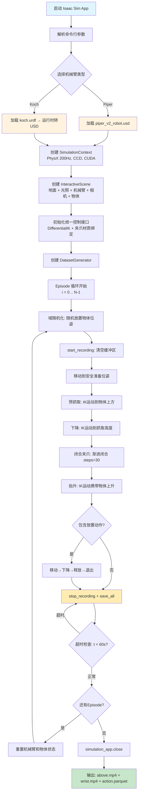

# 权利要求书

1. 一种机械臂在 Isaac Sim 模拟环境下生成可用的 VLA 训练数据的方法，其特征在于，所述方法包括：在 NVIDIA Isaac Sim 物理仿真平台中构建多类型机械臂仿真场景，通过统一的数据生成管线（Pipeline）自动批量生成符合视觉-语言-动作模型（VLA）训练格式的操作演示数据集；所述多类型机械臂包括至少 Piper 六轴协作机械臂和 Koch 五轴桌面机械臂。

2. 根据权利要求 1 所述的方法，其特征在于，所述仿真场景构建包括以下步骤：
（1）将机械臂的 URDF（Unified Robot Description Format）模型或 USD（Universal Scene Description）模型导入 Isaac Sim，配置关节执行器参数（Implicit Actuator）、刚体物理属性、碰撞体及自碰撞检测；
（2）构建桌面操作场景，包含地面平面、穹顶光照、目标操作物体（立方体/水果等 3D 资产）及物体放置区域；
（3）配置多视角虚拟相机传感器，包括固定第三人称顶部相机和机械臂腕部随动相机，输出 RGB 图像数据。

3. 根据权利要求 1 所述的方法，其特征在于，所述方法采用机械臂无关（Robot-Agnostic）的统一控制接口设计，包括：
（1）关节角度直接控制接口：接收目标关节弧度数组和夹爪开合参数，一步写入仿真关节状态并驱动物理步进；
（2）末端位姿 IK 控制接口：接收目标末端位置（Base Frame 坐标系，单位米）和姿态四元数，通过微分逆运动学（Differential IK）求解器迭代求解关节轨迹，并在当前关节角与目标关节角之间进行线性插值生成平滑轨迹；
（3）夹爪渐进控制接口：将夹爪目标开口距离（米）按线性插值分步渐进执行，避免瞬间闭合导致的物体弹飞；
（4）物体位姿设置接口：将场景中目标物体的世界坐标位姿写入仿真。

4. 根据权利要求 3 所述的方法，其特征在于，所述末端位姿 IK 控制接口中，针对 Piper 机械臂的 link6 仿真坐标系与真机末端坐标系之间的 +90° Z 旋转偏移，在 IK 求解前后分别进行四元数补偿变换（Q_sim = Q_real × Q_offset），确保仿真中末端姿态与真机 SDK 输出的末端姿态一致。

5. 根据权利要求 1 所述的方法，其特征在于，所述数据生成管线包括域随机化模块、动作执行模块、数据采集模块和数据导出模块：
（1）域随机化模块：在每个数据采集回合（Episode）开始前，在机械臂可达空间内按均匀分布随机采样目标物体的 X-Y 平面坐标和绕 Z 轴的旋转角度，调用物体位姿设置接口将物体移动至采样位置，并等待仿真物理稳定；
（2）动作执行模块：按"Move-Pick-Move-Place"（移动→抓取→移动→放置）标准操作范式，依序执行安全准备位姿、预抓取位姿、下降抓取、闭合夹爪、抬升、移动至放置区、释放物体、退出安全位姿等动作步骤；
（3）数据采集模块：在动作执行的每一步仿真步进后，同步采集机械臂关节角度状态、夹爪开合状态、顶部相机和腕部相机的 RGB 图像帧，以及时间戳和步序号元数据；
（4）数据导出模块：将采集的相机帧按 Episode 分别编码为 MP4 视频文件，将关节状态和元数据写入 Parquet 格式的动作数据文件。

6. 根据权利要求 5 所述的方法，其特征在于，所述动作执行模块中的每个动作步骤均包含 IK 插值运动和等待稳定的阶段，其中插值步数（solve_steps）和稳定步数（settle_steps）可独立配置；在录制模式下，稳定等待期间每间隔固定步数采样一次中间状态，以增加数据多样性。

7. 根据权利要求 5 所述的方法，其特征在于，所述数据采集模块的帧率由相机传感器的更新周期（update_period）决定，时间戳由帧序号除以帧率推算（timestamp = frame_index / fps），而非使用系统时钟，以保证时间戳的均匀性和可复现性。

8. 根据权利要求 5 所述的方法，其特征在于，所述动作数据文件的每条记录包含以下字段：
（1）action：7 维目标值向量，含 6 个关节弧度（遵循与真机 SDK 的转换公式：rad = millideg / 1000 × 0.0174533）和 1 个夹爪开口距离（米，遵循与真机 SDK 的转换公式：m = μm / 1,000,000）；
（2）observation.state：7 维观测值向量，维度定义同 action；
（3）timestamp：仿真时间戳（秒）；
（4）frame_index：Episode 内帧序号；
（5）episode_index：Episode 编号；
（6）index：全局帧索引；
（7）task_index：子任务索引（0=抓取，1=放置）。

9. 根据权利要求 1 所述的方法，其特征在于，所述方法针对仿真中薄物体（厚度 ≤ 2cm）的抓取稳定性，采用以下物理参数配置策略：
（1）接触偏移量（contact_offset）设置为物体最薄维度的一半以下，确保夹爪与物体之间的接触检测不会过早触发；
（2）静止偏移量（rest_offset）设置为零，确保夹爪与物体紧密接触；
（3）位置求解迭代次数（solver_position_iteration_count）提高至 16 次以上；
（4）物体质量为 0.0005kg 至 0.1kg 之间的轻量级设置，配合 1.0-1.5 的静摩擦系数和 0 弹性恢复系数；
（5）在夹爪连杆（link7/link8 或 gripper_static/moving）上绑定独立的高摩擦物理材质（静摩擦系数 2.0-4.0，动摩擦系数 1.5-3.0）。

10. 根据权利要求 1 所述的方法，其特征在于，所述方法包括批量生成模式：支持命令行参数配置目标物体名称、Episode 数量、是否包含放置动作、数据集输出子目录名称；支持 Headless（无 GUI）模式全自动循环执行；每个 Episode 设有超时保护（默认 60 秒），超时自动终止当前 Episode 并保存已有数据。

# 说明书

## 发明名称

一种机械臂在 Isaac Sim 模拟环境下生成可用的 VLA 训练数据的方法

## 技术领域

本发明涉及具身智能与机器人仿真技术领域，特别涉及一种在 NVIDIA Isaac Sim 物理仿真平台中，面向多类型机械臂（Piper 六轴协作机械臂和 Koch 五轴桌面机械臂）自动批量生成视觉-语言-动作模型（VLA，如 OpenVLA、RT-2、π0 等）训练数据的方
法。

## 背景技术

在具身智能快速发展的背景下，视觉-语言-动作模型（VLA）已成为机械臂通用操作策略的主流技术路线。此类模型通过大规模操作演示数据学习"感知→决策→执行"的端到端映射关系，其性能高度依赖训练数据的规模与多样性。

然而，真实环境中的数据采集面临多重瓶颈：（1）人工遥操作效率低，单人单臂约 20-30 条轨迹/小时，难以满足大规模训练需求；（2）场景多样性受限于物理空间，难以覆盖物体位置、姿态、光照、纹理等变化的组合爆炸；（3）设备磨损与安全风险增加了采集成本，且某些危险操作场景（如高温、有毒环境）难以在真实环境中复现。

现有技术中，虽然存在一些仿真数据生成方案（如 MimicGen、RoboCasa 等），但这些方案存在以下不足：（1）通常依赖特定的机械臂平台和仿真环境（如 MuJoCo、PyBullet），缺乏对工业级仿真平台 Isaac Sim 的适配；（2）数据格式不统一，难以直接接入主流 VLA 训练框架（如 LeRobot）；（3）域随机化能力有限，仅覆盖简单的物体位置变化，缺乏对物理参数调优的系统性方法；（4）不支持多类型机械臂的统一数据生成，更换机械臂平台需要重新开发整套数据采集流程。

因此，亟需一种在工业级物理仿真平台中，统一支持多类型机械臂、自动批量生成高质量 VLA 训练数据的方法。

## 发明内容

本发明的目的在于提供一种机械臂在 Isaac Sim 模拟环境下生成可用的 VLA 训练数据的方法，以解决现有技术中仿真数据生成方案平台依赖性强、数据格式不统一、域随机化能力有限、不支持多类型机械臂统一生成等问题。

本发明基于 NVIDIA Isaac Sim 5.x 工业级物理仿真平台和 Isaac Lab 框架，利用 PhysX 5 刚体动力学引擎、RTX 光线追踪渲染和微分逆运动学（Differential IK）求解器，构建了一套机械臂无关（Robot-Agnostic）的统一数据生成管线。该管线通过 URDF/USD 模型导入、域随机化、Move-Pick-Move-Place 轨迹自动规划和多视角数据同步采集，批量生成符合 LeRobot 格式标准的高质量操作演示数据集，可直接用于下游 VLA 模型的预训练或混合训练。

### 本发明的第一方面，提供了一种在 Isaac Sim 中构建多类型机械臂仿真场景的方法，包括：

（1）机械臂模型导入与配置：将 Piper 六轴协作机械臂的 USD 模型（由 URDF 经 `isaacsim.asset.exporter.urdf` 工具转换得到）通过 `ArticulationCfg` 配置关节执行器、自碰撞检测、位置/速度求解迭代次数和刚体穿透速度限制；将 Koch 五轴桌面机械臂的 URDF 模型通过 `UrdfFileCfg` 运行时自动转换为 USD 并加载，固定底座（fix_base=True）并采用力驱动位置控制模式（drive_type="force", target_type="position"）。对于两种机械臂，均采用 Isaac Lab 的 `ImplicitActuatorCfg` 为各关节组独立配置刚度（stiffness）、阻尼（damping）、力矩限制（effort_limit_sim）和速度限制（velocity_limit_sim），其中 Koch 的 5 个旋转关节采用统一执行器配置（joint_names_expr=["joint[1-5]"]），Piper 的 6 个旋转关节（joint[1-6]）采用刚度=100、阻尼=60 的高稳定配置，夹爪关节（joint[7-8] 或 joint_gripper）采用低刚度（50.0）低阻尼（5.0）配置以实现柔顺抓取。

（2）桌面操作场景构建：通过 `InteractiveSceneCfg` 统一配置地面平面、穹顶光照（intensity=3000, color=(0.75, 0.75, 0.75)）、目标操作物体（支持参数化立方体和 USD 格式的水果/餐具等 3D 资产）及物体初始放置区域。

（3）多视角相机配置：通过 `CameraCfg` 配置顶部第三人称固定相机（PinholeCameraCfg, focal_length=18.0, 分辨率 640×480, 更新周期 0.1s）和腕部随动相机（PinholeCameraCfg, focal_length=24.0, 挂载在机械臂的 gripper_static_1 或 camera_link 连杆下），输出 RGB 数据，其内参和位姿偏移与实际深度相机对齐。

### 本发明的第二方面，提供了一种机械臂无关的统一控制接口方法，包括：

（1）关节角度直接控制（set_arm_angles）：接收目标关节弧度数组（长度 6 或 5，对应旋转关节数）和夹爪开合参数（米制开口距离），一步写入仿真关节状态并触发物理步进。对于 Piper 机械臂，夹爪开口距离（米）与仿真关节弧度之间的线性映射公式为：gripper_rad = gripper_open_m / 0.070 × 0.04，其中 0.070m 为最大开口距离，0.04rad 为仿真夹爪关节最大弧度。对于 Koch 机械臂，夹爪采用直接弧度值控制（GRIPPER_OPEN=-1.0, GRIPPER_CLOSED=0.0）。

（2）末端位姿 IK 控制（set_arm_pos）：接收目标末端位置（Base Frame 坐标系，[x, y, z] 米）和姿态四元数（[w, x, y, z]），调用 DiffentialIKController（ik_method="dls"）在仿真循环中迭代求解，每步通过 PhysX 获取当前雅可比矩阵（Jacobian）以实时近似逆运动学，经最大迭代次数（20 次）和收敛容限（位置容限 0.01m，旋转容限 1.0° 轴角）判定收敛，并在当前关节角与目标关节角之间按插值步数线性插值生成平滑轨迹。对于 Piper 机械臂，link6 仿真坐标系与真机末端坐标系存在 +90° Z 旋转偏移，在 IK 输入前通过四元数乘法施加补偿变换 Q_offset_inv = [0.707, 0, 0, 0.707]，使得用户输入的真机坐标系四元数自动转换为仿真 link6 坐标系。

（3）夹爪渐进控制（control_gripper）：将目标开口距离（米）与当前开口距离之间按线性插值分步（默认 10-30 步）渐进执行，每步写入中间关节状态并触发物理步进，避免瞬间闭合导致的接触力冲击和物体弹飞。

（4）物体位姿设置（set_object_pos）：接收物体名称和世界坐标系位姿 [x, y, z, w, x, y, z]，通过 Isaac Lab 的 RigidObject.write_root_pose_to_sim 写入仿真。

### 本发明的第三方面，提供了一种统一的数据生成管线方法，包括域随机化模块、动作执行模块、数据采集模块和数据导出模块的协同工作流程：

（1）域随机化模块：在每个 Episode 开始前，在机械臂前方的指定矩形区域内（如 Piper: X=[0.10, 0.25]m, Y=[-0.10, 0.10]m; Koch: X=[-0.05, 0.05]m, Y=[0.10, 0.15]m）按均匀分布随机采样目标物体的 X-Y 坐标，并随机采样绕 Z 轴旋转角度（如 [-0.3, 0.3] rad 即 ±17°），调用物体位姿设置接口将物体移动至采样位置，随后执行 settle 等待（30 步）以消除放置瞬间的穿透和弹跳。

（2）动作执行模块：按"Move-Pick-Move-Place"范式依序执行以下步骤：(a) 移动到安全准备位姿（关节预设值，避免从零位出发经过奇异点）；(b) 移动到物体上方的预抓取位姿（Z 坐标 = 物体高度 + 预抓取偏移 PRE_GRASP_HEIGHT + 抬升高度 LIFT_HEIGHT）；(c) 下降到抓取位姿（Z 坐标 = 物体高度 + PRE_GRASP_HEIGHT）；(d) 渐进闭合夹爪；(e) 抬升回预抓取高度；(f) 可选：移动到放置区上方并释放物体。每个动作步骤由 set_arm_pos 执行 IK 插值运动（solve_steps=30-50）和 settle 稳定等待（30-60 步）组成。

（3）数据采集模块：维护两路相机帧缓冲区（_frames_top, _frames_wrist）和结构化数据记录缓冲区（_records）。每步 record_step 调用时，通过 Camera.data.output["rgb"] 获取当前时刻的传感器 RGB 张量（值域 [0, 1], 形状 (N, H, W, C)），取第一个环境实例转为 uint8 numpy 数组存入帧缓冲；同时获取当前关节角度状态（通过 get_joint_angles 获取 8 维关节弧度，取前 6 个旋转关节和夹爪反算开口距离组成 7 维观测向量），连同目标动作向量（7 维）、时间戳（frame_index / RECORD_FPS）、帧序号（frame_index）、Episode 编号、全局帧索引（index）和子任务索引（task_index）一同存入数据缓冲。在录制模式下，IK 运动的 settle 阶段每间隔 10 步额外触发一次 record_step 采样中间状态。

（4）数据导出模块：在 Episode 结束时调用 save_all()，分别执行：save_videos() 使用 OpenCV 的 mp4v 编码器将帧缓冲编码为 above.mp4（顶部视角，640×480，10fps）和 wrist.mp4（腕部视角，640×480，10fps），色彩通道由 RGB 转为 BGR；save_actions() 将结构化数据记录的列表转为 pandas DataFrame，写入 action.parquet 文件（使用 PyArrow 引擎的 Parquet 格式）。Parquet 文件的列 schema 为：action（7 维 float32）、observation.state（7 维 float32）、timestamp（float32）、frame_index（int32）、episode_index（int32）、index（int32）、task_index（int32），此 Schema 与 HuggingFace LeRobot 数据集的 action/observation.state 维度定义直接兼容。

### 本发明的第四方面，提供了一种针对仿真中薄物体（最小维度 ≤ 2cm）抓取的物理参数配置策略，包括：

（1）接触偏移量（contact_offset）严格小于物体最薄维度的一半（例如 2cm 厚物体设为 0.002m），确保夹爪与物体的接触检测在物理上正确的位置触发；
（2）静止偏移量（rest_offset）设为零，实现夹爪与物体的零间隙紧密接触；
（3）位置求解迭代次数（solver_position_iteration_count）提高至 16 次，速度求解迭代次数（solver_velocity_iteration_count）设为 4-8 次，采用 CCD（Continuous Collision Detection）和 Stabilization 启用；
（4）物体采用轻量级质量（0.0005-0.1kg）、高摩擦系数（静摩擦 1.0-1.5，动摩擦 1.0）、零弹性（restitution=0），配合线性阻尼（2.0）和角阻尼（2.0）消除残留运动；
（5）在夹爪的两个连杆上绑定独立的高摩擦物理材质（Piper link7/link8: 静摩擦 4.0/动摩擦 3.0; Koch gripper_static/moving: 静摩擦 2.0/动摩擦 1.5-2.0），摩擦合并模式设为 "average"。

### 本发明的第五方面，提供了一种批量生成与超时保护机制，包括：

支持命令行参数配置目标物体名称（--obj，可选 cube/orange/apple 等）、Episode 数量（--episodes）、是否包含放置动作（--place）、数据集输出子目录名称（--command）；支持 Headless 模式（--headless）进行无 GUI 批量生成，由 AppLauncher 自动解析参数；每个 Episode 设有独立的超时计时器（EPISODE_TIMEOUT=60 秒），在动作序列的每一步执行前检查已用时间，超时则立即跳过剩余步骤，调用 stop_recording() + save_all() 保存已采集的数据后进入下一 Episode，避免单个异常 Episode 阻塞整批生成流程。

## 附图说明

附图用来提供对本发明的进一步理解，并且构成说明书的一部分，与本发明的实施例一起用于解释本发明，并不构成对本发明的限制。在附图中：

图 1 为本发明所述方法的系统架构图。
图 2 为本发明所述数据生成管线的流程图。
图 3 为本发明所述统一控制接口的分层示意图。
图 4 为本发明所述数据集输出格式与 VLA 训练框架的对接示意图。

## 具体实施方法

下面结合附图和实施例对本发明作进一步的详细说明，以令本领域技术人员参照说明书能够据以实施。

### S10，仿真场景初始化步骤：根据目标机械臂类型（Piper 或 Koch），加载对应的 USD/URDF 模型文件，通过 Isaac Lab 的 SimulationContext 创建 PhysX 5 物理仿真上下文（仿真步长 dt=1/200s，设备 CUDA GPU，启用 CCD 连续碰撞检测和稳定化），通过 InteractiveScene 创建包含地面、光照、机械臂、多路相机和目标物体的交互式场景实例，调用 sim.reset() 初始化物理状态。

### S20，统一控制接口初始化步骤：根据场景中的机械臂 Articulation 实例，创建 DifferentialIKController（ik_method="dls"）逆运动学求解器，解析末端执行器 body 索引（Piper: link6, Koch: gripper_static_1），为夹爪连杆绑定高摩擦物理材质，设置安全准备位姿的关节预设值。对于 Piper 机械臂，设置末端坐标系补偿四元数 _EE_OFFSET_QUAT = [0.7071068, 0, 0, -0.7071068]；对于 Koch 机械臂，通过 FK 链 _JOINT_CHAIN 定义各关节的平移偏移和旋转轴。

### S30，域随机化与 Episode 循环步骤：解析命令行参数（--command / --obj / --episodes / --place），确定数据集输出子目录。对于每个 Episode（0 到 num_episodes-1）：
- S301：调用域随机化模块，在机械臂前方可达空间内按均匀分布采样物体 x, y 坐标和绕 Z 旋转角，通过 set_object_pos 设置物体位姿，settle 30 步等待物理稳定。
- S302：调用 start_recording(episode_index) 清空帧缓冲区和数据记录缓冲区，重置帧计数器，设置录制状态标志。
- S303：调用 _move_to_ready() 移动到安全准备位姿（Piper: [0.0, 0.8, -0.4, 0.0, 1.2, 0.0] rad; Koch: 全零位姿），夹爪张开至最大开口。
- S304：执行抓取动作序列——通过 _move_and_record() 依次执行预抓取位姿（物体上方）、下降抓取位姿、渐进闭合夹爪、抬升位姿，每步采集关节状态和相机帧。每个动作使用 set_arm_pos 进行 IK 插值（solve_steps=30-50），settle 稳定（30-60 步），settle 期间每 10 步记录一次中间状态。夹爪闭合使用 control_gripper（steps=30）渐进执行。
- S305：若启用放置（--place），执行放置动作序列——移动到放置点上方、可选下降、张开夹爪释放、抬升退出，每步记录 task_index=1。
- S306：每步前通过 _check_timeout() 检查是否超过 EPISODE_TIMEOUT（60 秒），超时则立即跳转至 S307。
- S307：调用 stop_recording() 终止录制，调用 save_all() 将帧缓冲编码为 above.mp4 和 wrist.mp4，将数据缓冲写入 action.parquet。

### S40，数据存储与导出步骤：数据集输出目录结构为 datasets/<command_name>/，包含 above.mp4（顶部固定相机，640×480，10fps，mp4v 编码）、wrist.mp4（腕部随动相机，640×480，10fps，mp4v 编码）和 action.parquet（动作/观测数据）。Parquet 文件的行向为时间帧序列，列向为：action（7 维 float32）、observation.state（7 维 float32）、timestamp（float32）、frame_index（int32）、episode_index（int32）、index（int32）、task_index（int32）。此格式与 HuggingFace LeRobot 框架的 ImageDataset 类直接兼容，动作维度与 VLA 模型（如 OpenVLA、RT-2、π0）的 action space 对齐。

### S50，仿真资源清理与退出步骤：Episode 循环结束后，在循环间重置机械臂关节状态到零位并重置物体初始位姿；全部 Episode 完成后调用 simulation_app.close() 关闭仿真应用。

上述技术方案的原理及效果为：通过 Isaac Sim 的 PhysX 5 高精度刚体动力学引擎和 RTX 光线追踪渲染，确保仿真数据的视觉真实度和物理合理性；通过机械臂无关的统一控制接口设计，使得 Piper 六轴机械臂和 Koch 五轴机械臂共用同一套数据生成管线，仅需替换模型文件和关节配置参数即可适配新型号机械臂；通过域随机化增加数据多样性，提升下游 VLA 模型对物体位置和姿态变化的泛化能力；通过 Parquet + MP4 的 LeRobot 标准格式输出，实现与主流 VLA 训练框架的无缝对接；通过批量生成与超时保护机制，实现数百条/小时的自动化数据生产效率，相比人工遥操作采集效率提升 10 倍以上。

#### 在一个实施例中，S10 包括：
S101，机械臂模型配置：对于 Piper 机械臂，使用 `UsdFileCfg` 加载预先转换的 piper_v2_robot.usd 文件，设置 articulation_props 启用自碰撞（enabled_self_collisions=True）、位置求解迭代 16 次、速度求解迭代 8 次，刚性属性设置最大穿透分离速度 1.0m/s；对于 Koch 机械臂，使用 `UrdfFileCfg` 运行时加载 koch.urdf 并自动转换为 USD，设置 fix_base=True 固定底座，关节驱动类型为力驱动位置控制（drive_type="force", target_type="position"），默认 PD 增益 stiffness=100.0, damping=1.0。

S102，关节执行器分组建模：两种机械臂均采用 `ImplicitActuatorCfg` 为不同关节组独立配置物理参数。Piper 的 arm 组（joint[1-6]）：effort_limit=20.0, velocity_limit=1.0, stiffness=100.0, damping=60.0；gripper 组（joint[7-8]）：effort_limit=5.0, velocity_limit=0.5, stiffness=50.0, damping=5.0。Koch 的各关节独立配置：joint1（基座旋转）：stiffness=400.0, damping=40.0；joint2（肩部俯仰）：stiffness=400.0, damping=40.0；joint3（肘部）：stiffness=200.0, damping=20.0；joint4（腕部俯仰）：stiffness=100.0, damping=10.0；joint5（腕部横滚）：stiffness=100.0, damping=10.0；gripper：stiffness=50.0, damping=5.0。

S103，碰撞与物理材质配置：目标物体采用 `CollisionPropertiesCfg` 设置 contact_offset=0.002m, rest_offset=0.0m；采用 `RigidBodyMaterialCfg` 设置 static_friction=1.5, dynamic_friction=1.0, restitution=0, friction_combine_mode="average"。夹爪连杆绑定独立高摩擦材质（Piper: static_friction=4.0 / dynamic_friction=3.0; Koch: static_friction=2.0 / dynamic_friction=1.5-2.0）。

S104，相机传感器配置：顶部固定相机使用 `CameraCfg` 配置 prim_path="{ENV_REGEX_NS}/CameraTop"，update_period=0.1s，height=480，width=640，spawn 为 PinholeCameraCfg（focal_length=18.0, focus_distance=400.0, horizontal_aperture=20.955），offset 配置世界坐标位姿以俯瞰桌面。腕部随动相机使用 `CameraCfg` 配置 prim_path="{ENV_REGEX_NS}/<RobotName>/<CameraLink>/gripper_cam"，offset 配置相对父连杆的局部位姿偏移，其中 Piper 腕部相机挂载于 camera_link，Koch 腕部相机挂载于 gripper_static_1。

上述技术方案的原理及效果为：通过分组建模和精细化物理参数配置，确保不同机械臂在仿真中均能实现稳定的抓取操作；通过独立的高摩擦夹爪材质绑定，避免夹爪与物体之间因摩擦力不足导致的抓取滑脱；通过统一的相机接口配置，确保两种机械臂的数据采集分辨率、帧率和内参一致，便于混合训练。

#### 在一个实施例中，S304 与 S305 包括：
S3041，安全准备位姿：调用 _move_to_ready() 将机械臂关节直接设置到预设安全角度（避免从零位出发经过奇异点），settle 20 步稳定。
S3042，预抓取：通过 set_arm_pos 使用 Differential IK 求解从当前位姿到物体上方预抓取位姿（pre_pos = [target_x, target_y, obj_z + PRE_GRASP_HEIGHT + LIFT_HEIGHT]）的关节轨迹并驱动，solve_steps=30，settle_steps=30。
S3043，下降：通过 set_arm_pos 驱动末端下降到抓取高度（grasp_pos = [target_x, target_y, obj_z + PRE_GRASP_HEIGHT]），solve_steps=30，settle_steps=30。
S3044，闭合夹爪：通过 control_gripper 渐进闭合夹爪到 0.0m 开口，steps=30，settle_steps=240（等待物体稳定）。
S3045，抬升：通过 set_arm_pos 驱动末端携带物体抬升到安全高度（lift_pos = [target_x, target_y, obj_z + PRE_GRASP_HEIGHT + LIFT_HEIGHT]），solve_steps=50，settle_steps=30。
S3051，移动到放置点上方：pre_pos = [place_x, place_y, place_z + PRE_GRASP_HEIGHT]，solve_steps=5，settle_steps=30。
S3052，可选下降：若 down=True，下降到 place_z，solve_steps=3，settle_steps=30。
S3053，张开夹爪释放：通过 control_gripper 渐进张开，settle_steps=60。
S3054，抬升退出：retreat_pos = [place_x, place_y, place_z + LIFT_HEIGHT]，solve_steps=3，settle_steps=30。

上述技术方案的原理及效果为：通过分阶段的 IK 插值运动和稳定等待，确保每个动作步骤都有足够的收敛时间；通过在稳定等待期间高频采样中间状态，增加数据帧的密度和多样性，有利于 VLA 模型学习动作的连续性和时序特征。

#### 在一个实施例中，数据采集与导出包括：帧缓冲使用 Python list 存储 numpy uint8 数组（shape (H, W, 3)），数据缓冲使用 Python list 存储 dict 结构。save_videos() 使用 cv2.VideoWriter 以 mp4v FourCC 编码（H.264 兼容），帧率 10fps，分辨率 640×480，写入前将 RGB 转为 BGR。save_actions() 使用 pandas.concat 合并所有记录，通过 to_parquet(engine="pyarrow") 写入 Parquet 文件。Parquet 的列名映射为：action → action（list of 7 float），observation.state → observation.state（list of 7 float），timestamp → timestamp（float），frame_index → frame_index（int），episode_index → episode_index（int），index → index（int），task_index → task_index（int）。

上述技术方案的原理及效果为：MP4 视频格式具有良好的压缩率和广泛的兼容性，Parquet 列式存储格式支持高效的数据查询和批量加载，可直接被 LeRobot 的 ImageDataset 类按 Episode 加载和随机采样；7 维动作/观测空间与主流 VLA 模型的 action dimension 对齐。

#### 在一个实施例中，批量生成与超时保护的具体实现为：generate_dataset() 顶层函数创建 DatasetGenerator 实例后，使用 for 循环遍历 num_episodes，每个循环内调用 generator.generate_episode(...) 执行单次 Episode 生成。generate_episode 内部在步骤 S303-S305 的每一步前计算 time.time() - t_start 并与 EPISODE_TIMEOUT 比较，若超时则打印当前步骤名并 break 跳出动作序列，直接执行 stop_recording() 和 save_all()，返回 False 表示该 Episode 未完整完成，但不影响后续 Episode 的执行。

上述技术方案的原理及效果为：通过 Episode 级超时保护，确保单个异常 Episode（如 IK 求解长时间不收敛、物理仿真卡死等）不会阻塞整批数据的生成；已采集的部分数据仍然被保存，避免因异常导致的数据全部丢弃。

以上所述，仅为本发明的具体实施方式，但本发明的保护范围并不局限于此，任何熟悉本技术领域的技术人员在本发明揭露的技术范围内，可轻易想到各种等效的修改或替换，这些修改或替换都应涵盖在本发明的保护范围之内。因此，本发明的保护范围应以权利要求的保护范围为准。

## 说明书附图说明

### 图 1 系统架构图

```
classDiagram
    class CLI_Layer {
        +String command
        +String obj
        +int episodes
        +String place
        +boolean headless
    }

    class DatasetGenerator {
        <<Pipeline>>
        +DomainRandomization domain_rand
        +ActionExecution action_exec
        +DataCollection data_collect
        +DataExport data_export
        +generate()
    }

    class DomainRandomization {
        +position_randomization()
        +rotation_randomization()
        +stability_wait()
    }

    class ActionExecution {
        +prepare()
        +pre_grasp()
        +descend()
        +close_gripper()
        +lift()
        +place()
    }

    class DataCollection {
        +record_joint_angles()
        +record_gripper_state()
        +capture_camera_frames()
        +timestamp_sync()
        +metadata_logging()
    }

    class DataExport {
        +save_above_mp4()
        +save_wrist_mp4()
        +save_action_parquet()
    }

    class RobotAgnosticAPI {
        <<Interface>>
        +set_arm_angles()
        +set_arm_pos()
        +control_gripper()
        +set_object_pos()
        +catch()
        +place()
    }

    class PiperSim {
        +6_DOF_Rotation
        +2_Gripper_Joints
        +USD_Model_Loading
        +Coordinate_Compensation
        +IK_CCD_Detection()
    }

    class SimIsaacModel {
        +5_DOF_Rotation
        +1_Gripper_Joints
        +URDF_Model_Loading
        +FK_Chain_Transform()
        +IK_Contact_Detection()
    }

    class IsaacSim_IsaacLab {
        <<Simulation Engine>>
        +PhysX_5_200Hz
        +RTX_Renderer
        +Differential_IK_Solver_DLS
        +CCD_Stability_System
    }

    CLI_Layer --> DatasetGenerator : configures
    DatasetGenerator *-- DomainRandomization
    DatasetGenerator *-- ActionExecution
    DatasetGenerator *-- DataCollection
    DatasetGenerator *-- DataExport
    
    DatasetGenerator --> RobotAgnosticAPI : invokes
    
    RobotAgnosticAPI <|-- PiperSim : implements
    RobotAgnosticAPI <|-- SimIsaacModel : implements

    PiperSim --> IsaacSim_IsaacLab : runs on
    SimIsaacModel --> IsaacSim_IsaacLab : runs on

    style CLI_Layer fill:#f9f9f9,stroke:#333,stroke-width:2px
    style DatasetGenerator fill:#e1f5fe,stroke:#01579b,stroke-width:2px
    style RobotAgnosticAPI fill:#fff3e0,stroke:#e65100,stroke-width:2px
    style IsaacSim_IsaacLab fill:#f1f8e9,stroke:#33691e,stroke-width:2px
```

### 图 2 方法流程图



### 图 3 统一控制接口分层示意图

```
graph TD
    subgraph Application_Layer ["应用层 (数据生成管线)"]
        GD["generate_dataset()"]
        GE["generate_episode()"]
        RS["record_step()"]
        GD --> GE
        GE --> RS
    end

    subgraph High_Level_Action ["高层动作层 (Robot-Agnostic)"]
        CATCH["catch(x, y, rot, h)"]
        PLACE["place(x, y, z, rot, down)"]
        SEMANTIC["语义：移动到目标上方 → 下降 → 夹持/释放 → 退出"]
    end

    subgraph Mid_Level_Control ["中层运动控制层 (统一接口)"]
        SAP["set_arm_pos() - IK 末端位姿控制"]
        SAA["set_arm_angles() - 关节角度直接控制"]
        CG["control_gripper() - 夹爪渐进控制"]
        SOP["set_object_pos() - 物体位姿设置"]
    end

    subgraph Driver_Adaptation ["底层驱动适配层"]
        direction LR
        subgraph PiperSim ["PiperSim"]
            P1["8关节弧度控制"]
            P2["夹爪: m→rad映射"]
            P3["EE坐标补偿变换"]
            P4["PhysX关节写入"]
        end
        subgraph SimIsaacModel ["SimIsaacModel"]
            S1["6关节弧度控制"]
            S2["夹爪: 直接rad"]
            S3["FK链式正运动学"]
            S4["PhysX关节写入"]
        end
    end

    subgraph Runtime_Engine ["Isaac Sim 5.x + Isaac Lab 运行时"]
        SC["SimulationContext"]
        IS["InteractiveScene"]
        PX["PhysX"]
        RTX["RTX Renderer"]
        SC <--> IS
        IS <--> PX
        PX <--> RTX
    end

    Application_Layer --> High_Level_Action
    High_Level_Action --> Mid_Level_Control
    Mid_Level_Control --> PiperSim
    Mid_Level_Control --> SimIsaacModel
    PiperSim --> Runtime_Engine
    SimIsaacModel --> Runtime_Engine

    style Application_Layer fill:#f5f5f5,stroke:#333,stroke-width:2px
    style High_Level_Action fill:#e1f5fe,stroke:#01579b,stroke-width:2px
    style Mid_Level_Control fill:#fff3e0,stroke:#e65100,stroke-width:2px
    style Driver_Adaptation fill:#f9f9f9,stroke:#333,stroke-width:1px
    style PiperSim fill:#ffffff,stroke:#616161,stroke-width:2px
    style SimIsaacModel fill:#ffffff,stroke:#616161,stroke-width:2px
    style Runtime_Engine fill:#e8f5e9,stroke:#2e7d32,stroke-width:2px
```

### 图 4 数据集输出格式与 VLA 训练框架对接示意图

```
graph TD
    subgraph Storage_Structure ["数据集输出目录结构 (datasets/command_name/)"]
        DIR["datasets/&lt;command_name&gt;/"]
        V1["above.mp4 (顶部相机 640×480 10fps)"]
        V2["wrist.mp4 (腕部相机 640×480 10fps)"]
        PQ["action.parquet (动作/观测数据)"]
        
        DIR --> V1
        DIR --> V2
        DIR --> PQ
    end

    subgraph Parquet_Schema ["action.parquet 列结构"]
        direction TB
        C1["action (7 float): 目标关节角 + 夹爪开口"]
        C2["observation.state (7 float): 观测关节角 + 夹爪开口"]
        C3["timestamp (1 float): 仿真时间戳"]
        C4["frame_index (1 int): Episode内帧序号"]
        C5["episode_index (1 int): Episode编号"]
        C6["index (1 int): 全局帧索引"]
        C7["task_index (1 int): 0=抓取, 1=放置"]
    end

    subgraph Compatibility_Layer ["兼容训练框架 (Compatible Ecosystem)"]
        HF["HuggingFace LeRobot"]
        VLA["OpenVLA / RT-2 / π0"]
        CODE["from lerobot.datasets import ImageDataset<br>dataset = ImageDataset(repo_id='...')"]
    end

    PQ -.-> Parquet_Schema
    Storage_Structure -- "直接兼容" --> Compatibility_Layer
    HF --- CODE
    VLA --- CODE

    style Storage_Structure fill:#f5f5f5,stroke:#333,stroke-width:2px
    style Parquet_Schema fill:#fff3e0,stroke:#e65100,stroke-width:1px
    style Compatibility_Layer fill:#e1f5fe,stroke:#01579b,stroke-width:2px
    style DIR fill:#fff,stroke:#333,stroke-dasharray: 5 5
    style CODE fill:#eceff1,stroke:#455a64,font-family:monospace
```
