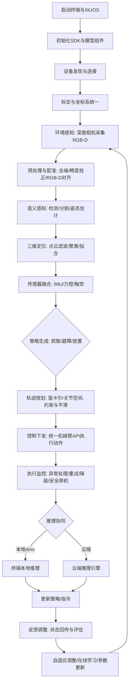

权利要求书
一种基于智能终端的机械臂-视觉协同的边端多场景感知控制系统及方法，其特征在于，所述设备包括：智能终端，深度相机通用软件开发工具包，机械臂通用软件开发工具包，深度相机图像信息处理和机械臂控制的软件系统，智能终端所适配的rknn图像识别模型的模型转换方法和模型使用方法。
所述智能终端包括：智能终端，终端大核运行Linux操作系统，用于实现智能决策，终端小核上运行XiUOS泛在操作系统，用于实现对深度相机的控制和数据采集和机械臂的控制。
所述深度相机通用软件开发工具包，为多种类型相机提供统一开发调用的应用程序编程接口（Application Programming Interface），并用于采集和处理深度相机的图像信息，实现环境感知和物体识别功能。
所述机械臂通用软件开发工具包，为多种类型机械臂提供统一开发调用的应用程序编程接口，用于控制机械臂的运动和操作，支持多自由度控制和路径规划。
所述深度相机图像信息处理和机械臂控制的软件系统，用于实现具身智能感知控制功能，集成深度相机和机械臂的数据，实现物品分类和交互操作的智能控制。
所述模型转换方法，包括将通用图像识别模型转换为适用于智能终端运行的rknn模型格式的方法，所述模型使用方法，包括在智能终端上部署和运行rknn模型的方法，实现本地推理和云端调用。
说明书
发明名称
一种基于智能终端的机械臂-视觉-多感知协同的边端多场景感知控制系统及方法
技术领域
本发明涉及具身智能技术领域，特别涉及一种终端智能控制系统及方法，更具体的说，是使用智能终端与多类型机械臂、多类型深度相机、多种类型传感器的协同工作，实现终端有限算力下的多场景智能感知与机械臂操作控制。
背景技术
随着人工智能和机器人技术的快速发展，具身智能系统在工业自动化、服务机器人等领域的应用日益广泛。机械臂作为具身智能系统的重要组成部分，其精确的操作能力和灵活的运动方式使其在各种复杂环境中发挥着重要作用。同时，深度相机作为环境感知的重要工具，能够提供丰富的三维空间信息，辅助机械臂实现更智能的操作。然而，现有的机械臂与深度相机系统通常存在集成复杂、适配性差、智能感知能力有限等问题，难以满足多场景下的应用需求。
尽管现有技术中已经存在一些机械臂与深度相机的集成方案，但这些方案往往依赖于特定的硬件平台和软件环境，缺乏通用性和灵活性，在实际应用与二次开发过程中，终端设备控制机械臂与深度相机的协同工作面临诸多挑战：
现有厂商提供的机械臂、深度相机和传感器通常采用不同的接口协议和数据格式，导致系统集成复杂，开发周期长，增加了系统的复杂性和维护成本。如不同厂商提供不同的软件开发工具包(SDK)，不同厂商的接口与上层应用互相耦合，造成底层机械臂或相机与上层应用逻辑难以分离，拓展适配性差，无法快速实现多外设的即插即用支持，若用户需要将本地USB相机替换为深度相机或进行机械臂的替换等硬件设备的替换，往往涉及修改底层驱动到上层逻辑的整条链路代码，工作量巨大，同时其运行效率，正确性等难以维持原有水平。
边端设备计算资源有限，难以确保系统在边端设备上能够流畅运行如何在有限的算力下实现高效的环境感知和智能控制。现有系统在处理复杂环境感知任务时，往往需要依赖云端计算资源，导致响应时间延长，影响系统的实时性和可靠性。
边缘应用场景多样化，需求多样化，系统需要具备良好的适应性和扩展性，以满足不同应用场景的需求。现有系统往往针对特定场景进行优化，缺乏通用性，难以适应多变的应用环境。针对不同场景下的不同需求，往往需要在硬件选择，软件配置等方面进行大量调整，增加了系统的复杂性和开发成本，极大的增加了开发成本和时间成本。
因此，设计一种通用性强、适配性好的机械臂-视觉协同系统，并结合智能终端和XiUOS泛在操作系统的优势，实现边端多场景感知控制，成为当前研究的热点和难点。
发明内容
本发明的目的在于提供一种基于智能终端的机械臂-视觉协同的边端多场景感知控制系统及方法，以解决现有技术中机械臂与深度相机集成复杂、适配性差、智能感知能力有限等问题，提升系统的通用性、适应性和智能化水平。本发明构建了一种集成智能终端、机械臂、深度相机和多种传感器的协同工作系统，通过统一的软件开发工具包和具身智能感知控制软件，实现了多类型机械臂和深度相机的无缝集成与协同工作，提升了系统的智能感知和操作控制能力。
本发明的第一方面，提供了一种基于智能终端的机械臂-视觉协同的边端多场景感知控制系统。该系统构建了智能终端、机械臂和深度相机的协同工作环境，集成了机械臂通用软件开发工具包和深度相机通用软件开发工具包，实现了对多类型机械臂和深度相机的统一控制和数据采集。系统还包括具身智能感知控制软件，能够处理深度相机采集的图像信息，实现环境感知和物体识别功能，并通过机械臂进行智能操作，具体包括：
智能终端，终端大核运行Linux操作系统，用于实现智能决策，终端小核上运行XiUOS泛在操作系统，用于实现对深度相机的控制和数据采集和机械臂的控制，作为系统的核心控制单元，通过机械臂通用软件开发工具包、深度相机通用软件开发工具包、XiUOS泛在操作系统所提供的感联知控相关组件及其能力，实现对机械臂、深度相机和各类传感器的统一管理和协调工作，促进工业领域人、机、物的深度互联。
机械臂通用软件开发工具包，通过与底层机械臂驱动进行解耦，将厂商底层通讯接口与软件开发工具包(SDK)层逻辑分离，并根据不同通讯接口开发统一的应用程序编程接口（API），同时多种类型机械臂开发调用接口统一，实现多种机械臂的运动控制和路径规划功能。
深度相机通用软件开发工具包，通过与底层深度相机/相机驱动进行解耦，将厂商底层通讯接口与软件开发工具包(SDK)层逻辑分离，并根据不同通讯接口和网络视频流开发统一的应用程序编程接口（API），实现多种类型深度相机的数据采集和图像处理功能。
多种传感器开发接口，通过XiUOS泛在操作系统提供的多外设即插即用统一系统，硬件统一接口层，应用统一调用层，支持多种传感器的快速集成和应用开发。
具身智能感知控制软件，模块化设计，集成机械臂和深度相机的数据处理功能，实现环境感知、物体识别和智能操作控制。该软件能够根据不同应用场景的需求，灵活配置和调整感知与控制策略，提升系统的适应性和智能化水平。
模型转换方法，包括将通用图像识别模型转换为适用于智能终端运行的rknn模型格式的方法，确保模型在边端设备上的高效运行和准确性，同时支持本地推理和云端调用，提升系统的智能感知和决策能力。
本发明的第二方面，提供了一种基于上述智能终端、通用软件开发工具包、具身智能感知控制软件的机械臂-视觉-多感知协同的边端多场景感知控制方法，该方法包括以下步骤：
步骤一，系统初始化：启动智能终端，加载XiUOS泛在操作系统，初始化各类传感器驱动程序，初始化智能终端支持的模型运行组件，初始化机械臂通用软件开发工具包和深度相机通用软件开发工具包相关组件及其环境依赖，确保机械臂和深度相机的正常连接和通信。
步骤二，环境感知：通过深度相机采集视角内的图像信息和深度信息，利用深度相机通用软件开发工具包获取图像信息，提供给具身智能感知控制软件进行处理，并通过多种传感器感知环境信息，实现环境感知和物体识别功能。
步骤三，智能控制：根据环境感知结果和任务需求，通过本地模型推理制定机械臂的操作策略，或将环境信息通过网络上传至云端大模型推理引擎使其进行分析处理，获取操作指令，或在终端本地调用大模型推理引擎进行分析处理，获取操作指令。最终利用具身智能感知控制软件生成机械臂的操作指令，通过机械臂通用软件开发工具包控制机械臂执行相应的操作任务。
步骤四，反馈调整：通过深度相机和传感器的实时反馈信息，通过具身智能感知控制软件进行智能实时监测分析机械臂的操作状态和环境变化，利用深度相机采集新的图像数据，调整机械臂的操作策略，确保任务的顺利完成。
附图说明
附图用来提供对本发明的进一步理解，并且构成说明书的一部分，与本发明 的实施例一起用于解释本发明，并不构成对本发明的限制。在附图中：
图 1为本发明所述系统的分层示意图。
图 2为本发明所述方法的从输入到执行的数据传递流程示意图。
具体实施方法
下面结合附图和实施例对本发明作进一步的详细说明，以令本领域技术人员参照说明书能够据以实施；如图所示，本发明提供了一种基于智能终端的机械臂-视觉协同的边端多场景感知控制系统及方法，包括：
S10，系统初始化步骤：启动智能终端，加载XiUOS泛在操作系统，初始化各类传感器驱动程序，初始化智能终端支持的模型运行组件，初始化机械臂通用软件开发工具包和深度相机通用软件开发工具包相关组件及其环境依赖，确保机械臂和深度相机的正常连接和通信。
S20，环境感知步骤：通过深度相机采集视角内的图像信息和深度信息，利用深度相机通用软件开发工具包获取图像信息，提供给具身智能感知控制软件进行处理，并通过多种传感器感知环境信息，实现环境感知和物体识别功能。
S30，智能控制步骤：根据环境感知结果和任务需求，通过本地模型推理制定机械臂的操作策略，或将环境信息通过网络上传至云端大模型推理引擎使其进行分析处理，获取操作指令，或在终端本地调用大模型推理引擎进行分析处理，获取操作指令。最终利用具身智能感知控制软件生成机械臂的操作指令，通过机械臂通用软件开发工具包控制机械臂执行相应的操作任务。
S40，反馈调整步骤：通过深度相机和各类传感器的实时反馈信息，由具身智能感知控制软件进行在线监测与分析，评估机械臂的执行效果与环境变化，实时采集新的图像与状态数据，动态调整操作策略或重新规划执行路径，确保任务稳定、可靠地完成。
S50，模型转换与部署步骤：将通用图像识别模型转换为适用于智能终端运行的rknn模型格式的方法，确保模型在边端设备上的高效运行和准确性，同时支持本地推理和云端调用，提升系统的智能感知和决策能力。
上述技术方案的原理及效果为：通过统一的接口层与调用层实现机械臂、深度相机与多传感器的解耦式集成，显著降低系统耦合度与适配成本；通过模型转换为rknn并在终端侧优化推理，满足边端算力受限条件下的实时性与准确性需求；通过“感知—决策—执行—反馈”的闭环控制，提高系统在多场景下的鲁棒性、可扩展性与任务成功率。
在一个实施例中，S10包括： S101，终端环境配置与驱动安装：在智能终端上安装并启用机械臂通用软件开发工具包、深度相机通用软件开发工具包、XiUOS感联知控组件与模型运行组件，完成依赖库、设备权限与网络参数配置； S102，设备发现与连接：通过统一设备管理接口枚举机械臂与相机设备，完成串口/以太网/USB等链路的连接与握手，建立心跳与状态同步； S103，参数与标定：执行深度相机内外参标定、手眼标定与坐标系统一，生成标定文件并下发至感知与控制模块； S104，模型转换与部署：将通用视觉模型导出并转换为rknn格式，进行精度与性能校验后部署到终端推理引擎，配置本地/云端推理切换与容错策略； S105，资源与安全控制：设置实时任务优先级、线程池规模、内存与算力配额，启用访问控制、日志审计与异常告警。
上述技术方案的原理及效果为：统一初始化流程降低跨设备适配复杂度；精准标定提升RGB-D配准与位姿估计准确性；模型rknn化与资源配额保障边端实时稳定运行与安全可控。
在一个实施例中，S20包括： S201，数据采集：配置帧率、分辨率与曝光等参数，并同时采集彩色与深度数据； S202，预处理与配准：对图像进行去噪、畸变校正与几何配准，实现色彩深度（RGB-D）信息对齐； S203，语义感知：执行目标检测/分类/分割与姿态估计，输出候选目标与语义标签； S204，三维重建与定位：对点云进行滤波、聚类与表面拟合，计算目标在机械臂坐标系下的位姿； S205，传感器融合：融合IMU、力控、触觉等数据，形成稳健的状态估计与场景理解结果。
上述技术方案的原理及效果为：视觉语义与几何信息的联合提升目标识别与定位精度；多源传感器融合增强系统对复杂环境与干扰的鲁棒性。
在一个实施例中，S30包括： S301，策略生成：依据任务需求与感知结果选择抓取、避障、放置等操作策略； S302，轨迹规划：在可达性与碰撞约束下生成笛卡尔或关节空间轨迹，并进行时序与速度平滑； S303，控制下发：通过统一机械臂软件编程结构层将轨迹与指令下发至控制器，执行握持、移动、释放等动作； S304，执行监控与异常处理：实时监测打滑、丢帧、通信异常等情况，触发重试、降级或安全停机； S305，本地/云端推理协同：在低时延场景优先本地推理，复杂场景可切换云端推理以提升策略质量。
上述技术方案的原理及效果为：统一控制接口与策略管理减少不同机械臂间的适配成本；闭环监控与异常处理提高任务成功率与安全性；边云协同兼顾实时性与智能性。
在一个实施例中，S40包括： S401，状态回传与评估：采集执行结果、误差与环境变化，计算关键指标； S402，自适应调整：根据反馈动态更新抓取参数、路径与控制增益； S403，在线学习与参数更新：对阈值、置信度与策略参数进行小幅在线优化； S404，记录与审计：生成结构化日志与任务报告，支持复现与持续改进。
上述技术方案的原理及效果为：通过反馈驱动的自适应调整实现持续优化，保障系统在多变场景下的稳定性、效率与可维护性。
在一个实施例中，S50包括：
S501，确定适用平台与选择对应工具链 - 适用芯片：RK3588/RK3568/RK3566 等具备NPU的Rockchip平台。 - 工具与运行时：开发侧使用 rknn-toolkit / rknn-toolkit2（Python），终端侧使用 rknn-toolkit-lite / lite2（Python）或 librknn_api（C）。 - 版本匹配：转换工具版本需与终端固件内置的 RKNN Runtime 版本匹配，避免“版本不兼容/模型不可加载”。实际以Rockchip官方发布的版本对照为准。
S502，模型转换 - 模型类型：支持分类、检测、分割等常见视觉任务模型。 - 模型格式：ONNX、TFLite、Caffe、TensorFlow（SavedModel/FrozenGraph）。PyTorch需先导出ONNX；Keras/TF可直接TFLite或SavedModel。 - 环境依赖：Python 3.10，安装rknn-toolkit2（推荐）或rknn-toolkit，以及ONNX/TensorFlow等对应框架支持库。 - 数据预处理与量化校准集准备：与训练时预处理一致的无标注自然图像，建议100~1000张，列表写入dataset.txt。
S503，模型使用 - Python接口：使用rknn-toolkit-lite2（推荐）或rknn-toolkit-lite进行加载与推理，适合快速开发与调试。 - 运行时接口：将librknnrt.so加载到linux的系统库目录下，当python使用rknn-toolkit-lite时会自动调用 - 预处理与后处理：确保与转换时预处理一致，输出结果结合类别表进行语义映射。
上述技术方案的原理及效果为：通过模型转换与优化，实现边端设备上的高效推理与部署，提升系统的智能感知与决策能力。
以上所述，仅为本发明的具体实施方式，但本发明的保护范围并不局限于此，任何熟悉本技术领域的技术人员在本发明揭露的技术范围内，可轻易想到各种等效的修改或替换，这些修改或替换都应涵盖在本发明的保护范围之内。因此，本发明的保护范围应以权利要求的保护范围为准。
说明书附图说明
图1 系统分层图
  
图2 方法流程图 

