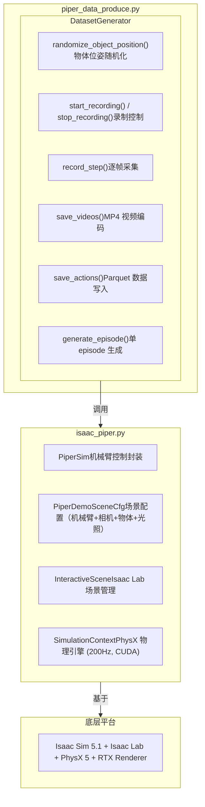

# 基于 Isaac Sim 的 Piper 机械臂仿真数据生成 — 实训手册

> **项目名称**: 基于 Isaac Sim 的 Piper 机械臂仿真数据生成系统  
> **作者**: 侯云龙  
> **日期**: 2026-06-23  
> **适用版本**: NVIDIA Isaac Sim 5.1 + Isaac Lab  

---

## 目录

1. [环境安装](#1-环境安装)
2. [项目结构概览](#2-项目结构概览)
3. [系统架构](#3-系统架构)
4. [核心模块详解](#4-核心模块详解)
5. [使用指南](#5-使用指南)
6. [数据格式说明](#6-数据格式说明)
7. [API 接口参考](#7-api-接口参考)
8. [参数配置](#8-参数配置)
9. [常见问题与排错](#9-常见问题与排错)
10. [进阶开发](#10-进阶开发)

---

## 1. 环境安装

### 1.1 硬件要求

| 组件 | 最低要求 | 推荐配置 |
|------|----------|----------|
| GPU | NVIDIA RTX 3070 (8GB VRAM) | NVIDIA RTX 5090 (32GB VRAM) |
| CPU | 8 核 | 16 核以上 |
| 内存 | 32 GB | 64 GB |
| 磁盘 | 100 GB SSD | 500 GB NVMe SSD |
| 操作系统 | Ubuntu 22.04 / 24.04 | Ubuntu 24.04 LTS |

### 1.2 软件依赖

```
NVIDIA Driver     >= 550.x
CUDA              >= 12.4
Isaac Sim         5.1
Isaac Lab         (内置于 Isaac Sim)
conda             >= 24.x
Python            3.11
```

### 1.3 安装步骤

#### Step 1: 安装 NVIDIA 驱动与 CUDA

```bash
# 检查当前驱动版本
nvidia-smi

# 如未安装，通过 Ubuntu 驱动管理器安装
sudo apt update
sudo apt install nvidia-driver-550
sudo reboot
```

#### Step 2: 安装 Isaac Sim 5.1

从 [NVIDIA Omniverse](https://www.nvidia.com/en-us/omniverse/) 下载 Omniverse Launcher，通过 Launcher 安装 Isaac Sim 5.1。

或者使用命令行安装：

```bash
# 下载 Isaac Sim 5.1 (具体 URL 请从 NVIDIA 官网获取)
wget https://install.launcher.omniverse.nvidia.com/installers/omniverse-launcher-linux.AppImage
chmod +x omniverse-launcher-linux.AppImage
./omniverse-launcher-linux.AppImage
```

#### Step 3: 创建 conda 环境

```bash
# 创建 Python 3.11 环境
conda create -n env_isaaclab python=3.11 -y
conda activate env_isaaclab

# 安装核心依赖
pip install torch torchvision --index-url https://download.pytorch.org/whl/cu124
pip install numpy pandas opencv-python h5py pyarrow

# Isaac Lab 路径配置（根据实际安装路径调整）
export ISAACSIM_PATH="${HOME}/.local/share/ov/pkg/isaac_sim-5.1.0"
export ISAACLAB_PATH="${ISAACSIM_PATH}/extscache/isaaclab"
```

#### Step 4: 验证安装

```bash
# 启动 Isaac Sim Python 环境测试
conda run -n env_isaaclab python -c "import isaaclab; print('Isaac Lab OK')"
conda run -n env_isaaclab python -c "import omni; print('Omniverse OK')"
```

#### Step 5: 克隆项目

```bash
cd ~
git clone <repository-url> isaac-sim-lerobot
cd isaac-sim-lerobot
```

### 1.4 环境变量设置

将以下内容添加到 `~/.bashrc` 或项目中创建 `.env` 文件：

```bash
# Isaac Sim 路径
export ISAACSIM_PATH="${HOME}/.local/share/ov/pkg/isaac_sim-5.1.0"

# Isaac Lab 路径
export ISAACLAB_PATH="${ISAACSIM_PATH}/extscache/isaaclab"

# 项目路径
export PIPER_PROJECT_PATH="${HOME}/isaac-sim-lerobot"

# 数据集输出路径
export PIPER_DATASET_PATH="${PIPER_PROJECT_PATH}/datasets"
```

---

## 2. 项目结构概览

```
isaac-sim-lerobot/
├── isaac_piper.py                 # [核心] PiperSim 类 + 场景配置 + 测试函数
├── piper_data_produce.py          # [核心] DatasetGenerator + 批量数据生成入口
├── 项目.md                        # 项目规划文档
├── 实训手册.md                    # 本文档
├── README.md                      # 项目 README
│
├── assets/                        # 资产目录
│   ├── piper_isaac_sim/           # Piper 机械臂 USD 模型
│   │   └── USD/
│   │       └── piper_v2_robot.usd
│   ├── scenes/                    # 场景资产
│   │   └── kitchen_with_orange/
│   │       └── assets/Orange001/
│   ├── fruit/                     # 水果 3D 模型
│   │   └── green_apple.usd
│   └── background.jpg             # 地板纹理
│
├── datasets/                      # 数据集输出目录
│   └── <command_name>/            # 按命令名分子目录
│       ├── above.mp4              # 顶部相机视频
│       ├── wrist.mp4              # 腕部相机视频
│       └── action.parquet         # 动作/观测数据
│
├── urdf/                          # URDF 模型转换中间目录
├── run_http_server.sh             # HTTP 服务器启动脚本
└── kill_isaac_http_server.sh      # HTTP 服务器停止脚本
```

---

## 3. 系统架构

### 3.1 整体架构图



### 3.2 数据流图

```
flowchart TD
    START([仿真环境初始化]) --> DOMAIN_RAND[随机放置物体 域随机化]
    DOMAIN_RAND --> REC_START[start_recording 清空缓冲区]
    
    subgraph GRASP_SEQ [抓取动作序列]
        direction TB
        MOVE_READY[_move_to_ready 预抓取位姿]
        DESCEND[下降至物体]
        CLOSE[闭合夹爪]
        LIFT[抬升离开桌面]
        
        MOVE_READY --> DESCEND
        DESCEND --> CLOSE
        CLOSE --> LIFT
    end

    REC_START --> MOVE_READY

    subgraph STEP_REC [数据记录循环]
        RECORD_STEP[每步调用 record_step]
    end

    LIFT -.-> RECORD_STEP
    MOVE_READY -.-> RECORD_STEP
    DESCEND -.-> RECORD_STEP
    CLOSE -.-> RECORD_STEP

    LIFT --> PLACE_SEQ_OPT

    subgraph PLACE_SEQ_OPT [可选: 放置动作序列]
        direction LR
        P_MOVE[移动] --> P_DESC[下降]
        P_DESC --> P_RELEASE[释放]
        P_RELEASE --> P_LIFT[抬升]
    end

    PLACE_SEQ_OPT --> REC_STOP

    subgraph REC_STOP [stop_recording 停止并保存]
        direction TB
        SAVE_VID[save_videos]
        SAVE_ACT[save_actions]
        
        SAVE_VID --> VID_FILES[above.mp4 / wrist.mp4]
        SAVE_ACT --> PARQUET[action.parquet]
    end

    style START fill:#f9f,stroke:#333,stroke-width:2px
    style DOMAIN_RAND fill:#bbf,stroke:#333
    style REC_START fill:#dfd,stroke:#333
    style GRASP_SEQ fill:#fff,stroke:#333,stroke-dasharray: 5 5
    style PLACE_SEQ_OPT fill:#fff,stroke:#333,stroke-dasharray: 5 5
    style REC_STOP fill:#fdd,stroke:#333
```

---

## 4. 核心模块详解

### 4.1 `PiperDemoSceneCfg` — 场景配置类

定义在 [isaac_piper.py:196-350](isaac_piper.py#L196-L350)，基于 `@configclass` 装饰器，包含以下组件：

| 组件 | Prim 路径 | 说明 |
|------|-----------|------|
| `ground` | `/World/defaultGroundPlane` | 地面平面 |
| `light` | `/World/Light` | 穹顶光照 (3000 lux, 色温 7500K) |
| `piper` | `{ENV_REGEX_NS}/Piper` | Piper 六轴机械臂 (USD 导入) |
| `top` | `{ENV_REGEX_NS}/CameraTop` | 第三人称顶部相机 (640×480, 10fps) |
| `gripper_cam` | `{ENV_REGEX_NS}/Piper/camera_link/gripper_cam` | 腕部相机 (640×480, 10fps) |
| `cube` | `{ENV_REGEX_NS}/Cube` | 可抓取立方体 (8×2×3cm, 红色) |
| `orange` | `{ENV_REGEX_NS}/Orange` | 橙子模型 |
| `apple` | `{ENV_REGEX_NS}/Apple` | 苹果模型 |

**机械臂物理参数：**

```python
# 关节执行器
"arm":     effort_limit=20.0,  velocity_limit=1.0,  stiffness=100, damping=60
"gripper": effort_limit=5.0,   velocity_limit=0.5,  stiffness=50,  damping=5
```

### 4.2 `PiperSim` — 机械臂控制类

定义在 [isaac_piper.py:352-781](isaac_piper.py#L352-L781)，核心方法的调用关系如下：

```
PiperSim(scene)
  ├── .get_joint_angles()          → [j1..j8] 当前关节弧度
  ├── .get_arm_pos()               → 末端位姿 (base frame, pos+quat)
  ├── .get_arm_pos_euler()         → 末端位姿 (base frame, pos+Euler XYZ)
  ├── .set_arm_angles(rad, grip)   → 直接设置关节角度（一步到位）
  ├── .set_arm_pos(pos, quat, ...) → IK 求解并驱动到目标位姿（插值运动）
  │   └── .isaac_ik_trace(...)     → DifferentialIK 轨迹求解
  ├── .set_object_pos(name, p, q)  → 设置物体世界位姿
  ├── .control_gripper(m, steps)   → 渐进式夹爪控制
  ├── .catch(x, y, rot, h)         → 高层抓取（4步：准备→下降→闭合→抬升）
  ├── .place(x, y, z, rot, down)   → 高层放置（4步：移动→下降→释放→抬升）
  ├── ._move_to_ready(grip)        → 移动到安全准备位姿
  └── ._settle(steps)              → 等待仿真稳定
```

#### 夹爪映射关系

```
真机夹爪开口 (μm)  →  CSV 存储 (m)  →  仿真关节 (rad)
    70000 μm      →    0.070 m     →    0.04 rad (GRIPPER_MAX_RAD)
        0 μm      →    0.000 m     →    0.00 rad

转换公式: gripper_rad = (gripper_open_m / 0.070) × 0.04
```

#### 坐标系统

```
末端坐标系补偿:
  - 仿真 link6 坐标系相对真机末端有 +90° Z 旋转偏移
  - _EE_OFFSET_QUAT = [0.7071068, 0, 0, -0.7071068]
  - set_arm_pos 输入真机坐标系四元数，内部自动转换
```

### 4.3 `DatasetGenerator` — 数据生成器类

定义在 [piper_data_produce.py:126-410](piper_data_produce.py#L126-L410)，完整数据生成生命周期：

```
DatasetGenerator(piper, scene, command_name, output_root)
  │
  ├── generate_episode(obj_name, ..., episode_index)  ← 顶层入口
  │     │
  │     ├── 1. randomize_object_position(obj, x_range, y_range, z)
  │     │       └── piper.set_object_pos() → _settle(30)
  │     │
  │     ├── 2. start_recording(episode_index)
  │     │       └── 清空 _frames_top, _frames_wrist, _records
  │     │
  │     ├── 3. _move_to_ready()  → 安全准备位姿
  │     │
  │     ├── 4. 预抓取 → _move_and_record(pos_above, quat, OPEN, steps, task=0)
  │     │     └── record_step() × N  （采集起始状态+运动过程）
  │     │
  │     ├── 5. 下降 → _move_and_record(pos_grasp, quat, OPEN, steps, task=0)
  │     │
  │     ├── 6. 闭合 → control_gripper(CLOSE) → record_step() × N
  │     │
  │     ├── 7. 抬升 → _move_and_record(pos_lift, quat, CLOSE, steps, task=0)
  │     │
  │     ├── 8. (可选) 放置序列 → _move_and_record × 4 → task=1
  │     │
  │     ├── 9. stop_recording()
  │     └──10. save_all()
  │           ├── save_videos()  → above.mp4 + wrist.mp4
  │           └── save_actions() → action.parquet
  │
  └── 每步前 _check_timeout(t_start) → 超过 EPISODE_TIMEOUT(60s) 则终止
```

### 4.4 `generate_dataset()` — 批量生成入口

定义在 [piper_data_produce.py:417-441](piper_data_produce.py#L417-L441)：

```
generate_dataset(command_name, obj_name, num_episodes, place)
  │
  ├── 创建 SimulationContext (200Hz, CUDA, CCD+Stabilization)
  ├── 创建 InteractiveScene(PiperDemoSceneCfg)
  ├── 创建 PiperSim(scene)
  ├── 创建 DatasetGenerator(piper, scene, command_name)
  │
  └── for episode_index in range(num_episodes):
        ├── generator.generate_episode(obj_name, ...)
        ├── 重置机械臂关节到零位
        └── 重置物体初始位姿
```

---

## 5. 使用指南

### 5.1 基本运行命令

#### 抓取数据生成（仅抓取，不放置）

```bash
conda run -n env_isaaclab python -u piper_data_produce.py \
    --command pick_pink_cube \
    --obj cube \
    --episodes 5
```

#### 抓取+放置数据生成

```bash
conda run -n env_isaaclab python -u piper_data_produce.py \
    --command pick_and_place_cube \
    --obj cube \
    --episodes 10 \
    --place
```

#### 使用不同物体

```bash
# 使用橙子
conda run -n env_isaaclab python -u piper_data_produce.py \
    --command pick_orange \
    --obj orange \
    --episodes 5

# 使用苹果
conda run -n env_isaaclab python -u piper_data_produce.py \
    --command pick_apple \
    --obj apple \
    --episodes 5
```

### 5.2 命令行参数说明

| 参数 | 类型 | 必填 | 默认值 | 说明 |
|------|------|------|--------|------|
| `--command` | str | 是 | `pick_pink_cube` | 数据集子目录名称 |
| `--obj` | str | 否 | `cube` | 目标物体名称 (`cube` / `orange` / `apple`) |
| `--episodes` | int | 否 | `5` | 生成的 episode 数量 |
| `--place` | flag | 否 | `False` | 是否包含放置动作 |
| `--headless` | flag | 否 | `False` | 无头模式（无 GUI） |

### 5.3 输出检查

运行完成后，检查输出目录：

```bash
ls datasets/pick_pink_cube/
# 预期输出:
#   above.mp4        — 顶部视角视频
#   wrist.mp4        — 腕部视角视频
#   action.parquet   — 动作/观测数据
```

### 5.4 数据验证

```bash
conda run -n env_isaaclab python -c "
import pandas as pd
df = pd.read_parquet('datasets/pick_pink_cube/action.parquet')
print('总帧数:', len(df))
print('列名:', df.columns.tolist())
print('episode 分布:', df['episode_index'].value_counts().to_dict())
print(df.head())
"
```

### 5.5 测试函数

[isaac_piper.py](isaac_piper.py) 中包含多个测试函数，可单独运行验证各项功能：

```bash
# 测试物体随机放置
conda run -n env_isaaclab python -c "
import isaac_piper; isaac_piper.test_obj()
"

# 测试抓取+放置流程（3 轮 trial）
conda run -n env_isaaclab python -c "
import isaac_piper; isaac_piper.catch_and_place_test()
"

# 测试 IK 求解（坐标转换验证）
conda run -n env_isaaclab python -c "
import isaac_piper; isaac_piper.test_ik()
"
```

### 5.6 紧急停止

```bash
# 强制终止所有 piper_data_produce 进程
kill -9 $(pgrep -f "piper_data_produce.py")

# 或终止所有 Python 仿真进程
pkill -9 -f "isaac"
```

---

## 6. 数据格式说明

### 6.1 目录结构

```
datasets/
  <command_name>/
    above.mp4          # 顶部视角视频 (CameraTop), 640x480, 10fps, mp4v 编码
    wrist.mp4          # 腕部视角视频 (gripper_cam), 640x480, 10fps, mp4v 编码
    action.parquet     # 动作和观测数据 (LeRobot 兼容格式)
```

### 6.2 `action.parquet` 字段详解

| 字段 | 维度 | 数据类型 | 说明 |
|------|------|----------|------|
| `action` | 7 | float32 | **目标关节值** `[j1, j2, j3, j4, j5, j6 (rad), gripper_open (m)]` |
| `observation.state` | 7 | float32 | **当前观测值** `[j1, j2, j3, j4, j5, j6 (rad), gripper_open (m)]` |
| `timestamp` | 1 | float32 | 仿真时间戳（秒），从 episode 开始计时 |
| `frame_index` | 1 | int32 | Episode 内的帧序号（从 0 开始） |
| `episode_index` | 1 | int32 | Episode 编号（从 0 开始） |
| `index` | 1 | int32 | 全局帧索引（跨 episode 递增） |
| `task_index` | 1 | int32 | 子任务索引：`0` = 抓取 (catch), `1` = 放置 (place) |

### 6.3 关节角度与真机对应关系

```
Parquet 字段          真机 SDK 原始值           转换关系
─────────────────────────────────────────────────────────────
action[j1..j6] (rad)  GetArmJointMsgs (0.001°)   rad = millideg / 1000 × 0.0174533
action[6] (m)         GetArmGripperMsgs (μm)      m = μm / 1_000_000

真机回放:
  joint_ctrl = rad / 0.0174533 × 1000  → 传入 piper.JointCtrl()
  gripper_ctrl = m × 1_000_000         → 传入 piper.GripperCtrl()
```

### 6.4 LeRobot 格式兼容性

`action.parquet` 遵循 [LeRobot](https://github.com/huggingface/lerobot) 数据集规范：

- 动作维度 7（6 关节 + 1 夹爪）与 LeRobot 的 `action` 张量直接对齐
- 观测维度 7 与 `observation.state` 对齐
- 视频文件 `above.mp4` / `wrist.mp4` 可被 LeRobot 的 `ImageDataset` 直接加载
- 如需添加更多相机视角，在 `PiperDemoSceneCfg` 中添加新的 `CameraCfg` 即可

### 6.5 读取示例

```python
import pandas as pd
import cv2

# 读取动作数据
df = pd.read_parquet("datasets/pick_pink_cube/action.parquet")
print(f"Episodes: {df['episode_index'].nunique()}")
print(f"总帧数: {len(df)}")
print(f"数据列: {df.columns.tolist()}")

# 读取视频
cap_above = cv2.VideoCapture("datasets/pick_pink_cube/above.mp4")
cap_wrist = cv2.VideoCapture("datasets/pick_pink_cube/wrist.mp4")

# 按 episode 过滤
ep0 = df[df['episode_index'] == 0]
print(f"Episode 0: {len(ep0)} 帧, "
      f"task_index 分布: {ep0['task_index'].value_counts().to_dict()}")
```

---

## 7. API 接口参考

### 7.1 `PiperSim` 完整接口

```python
class PiperSim:
    # ── 构造 ──
    def __init__(self, scene: InteractiveScene)

    # ── 状态获取 ──
    def get_joint_angles(self) -> torch.Tensor
        """返回 [j1..j8] 8 个关节角度 (rad)，shape (1, 8)"""

    def get_arm_pos(self) -> tuple[list[float], list[float]]
        """返回 (pos_xyz[3], quat_wxyz[4])，base frame，已补偿 link6 偏移"""

    def get_arm_pos_euler(self) -> tuple[list[float], list[float]]
        """返回 (pos_xyz[3], euler_xyz_deg[3])"""

    # ── 运动控制 ──
    def set_arm_angles(
        self,
        angles_rad: Sequence[float] | None = None,   # [j1..j6] rad
        gripper_open_m: float | None = None           # 夹爪开口 (m), 0.0~0.070
    ) -> bool
        """一步到位设置关节角度，写入仿真并执行 1 步"""

    def set_arm_pos(
        self,
        target_pos_b: list[float],      # [x, y, z] base frame (m)
        target_quat_b: list[float],     # [w, x, y, z] base frame (真机坐标系)
        gripper_open_m: float = 0.070,  # 夹爪开口 (m)
        solve_steps: int = 1,           # IK 插值步数
        smooth: bool = False            # 平滑模式（夹持时使用）
    )
        """IK 求解并驱动到目标末端位姿，内部调用 isaac_ik_trace"""

    def isaac_ik_trace(
        self,
        target_pos_b: list[float],
        target_quat_b: list[float],
        steps: int = 1,
        gripper_open_m: float | None = None,
        smooth: bool = False
    ) -> list[list[float]]
        """返回长度为 steps 的关节轨迹点列表"""

    # ── 夹爪控制 ──
    def control_gripper(
        self,
        gripper_open_m: float = 0.01,  # 目标开口 (m)
        steps: int = 10                 # 插值步数
    )
        """渐进式控制夹爪开合"""

    # ── 物体操作 ──
    def set_object_pos(
        self,
        obj_name: str,                  # 物体名称 ("cube"/"orange"/"apple")
        pos: list[float],               # [x, y, z] 世界坐标 (m)
        quat: list[float] = [1,0,0,0]  # [w, x, y, z]
    )
        """设置物体世界位姿"""

    # ── 高层动作 ──
    def catch(
        self,
        target_x: float,    # 抓取点 X (m)
        target_y: float,    # 抓取点 Y (m)
        rot_rad: float,     # 末端绕 Z 旋转角 (rad)
        height: float       # 抓取高度 (m)
    ) -> bool
        """执行完整抓取动作: 准备→预抓取→下降→闭合→抬升"""

    def place(
        self,
        target_x: float,    # 放置点 X (m)
        target_y: float,    # 放置点 Y (m)
        target_z: float,    # 放置点 Z (m)
        rot_rad: float = 0, # 末端绕 Z 旋转角 (rad)
        down: bool = False  # 是否先下降再释放
    ) -> bool
        """执行完整放置动作: 移动→(下降)→释放→抬升"""

    # ── 辅助 ──
    def _move_to_ready(self, gripper_open_m: float = 0.10)
        """移动到安全准备位姿 READY_JOINTS_RAD"""

    def _settle(self, steps: int = 60)
        """等待仿真稳定，空跑 steps 步"""
```

### 7.2 关键常量

```python
# 夹爪物理范围
GRIPPER_MAX_OPEN_M = 0.070   # 最大开口 70mm
GRIPPER_MAX_RAD    = 0.04    # 仿真关节最大弧度

# 运动参数
PRE_GRASP_HEIGHT   = 0.12    # 预抓取高度（物体上方）
LIFT_HEIGHT        = 0.12    # 抓取后抬升高度
GRASP_SETTLE_STEPS = 60      # 动作后稳定步数
MIN_Z              = 0.04    # 末端最低高度

# 安全准备位姿 (rad)
READY_JOINTS_RAD = [0.0, 0.8, -0.4, 0.0, 1.2, 0.0]

# 夹爪张开开口
GRASP_OPEN = 0.10            # 夹爪张开时开口距离 (m)

# 仿真参数
SIM_DT   = 1.0 / 200.0       # 200Hz 仿真频率
CAM_FPS  = 10                # 相机采集帧率
```

---

## 8. 参数配置

### 8.1 域随机化参数

在 [piper_data_produce.py:92-106](piper_data_produce.py#L92-L106) 中定义：

```python
# ── 物体随机放置范围（机械臂前方）──
OBJ_X_RANGE = (0.10, 0.25)      # X: 10~25cm (前后)
OBJ_Y_RANGE = (-0.10, 0.10)     # Y: ±10cm (左右)
OBJ_Z_FIXED = 0.03              # Z: 固定 3cm (物体半高，着地)

# ── 抓取旋转角 ──
ROT_RAD_RANGE = (-0.3, 0.3)     # ±17° 绕 Z 轴

# ── 放置点范围 ──
PLACE_X_RANGE = (-0.10, 0.10)
PLACE_Y_RANGE = (0.15, 0.25)
PLACE_Z_FIXED = 0.10

# ── 录制参数 ──
RECORD_FPS = 10                 # 录制帧率 (与相机 update_period=0.1s 对齐)
EPISODE_TIMEOUT = 60.0          # 单 episode 超时 (秒)
```

### 8.2 物体物理参数

在 [isaac_piper.py:85-92](isaac_piper.py#L85-L92) 中定义：

```python
OBJ_L = 0.08    # 方块长 (m)
OBJ_W = 0.02    # 方块宽 (m)
OBJ_H = 0.03    # 方块高 (m)
OBJ_Z = 0.015   # 方块半高 = 着地放置 Z 坐标
```

### 8.3 相机参数

```python
CAM_HEIGHT = 480       # 画面高度 (px)
CAM_WIDTH  = 640       # 画面宽度 (px)
# 顶部相机位姿: pos=(0.31538, 0.01713, 0.62), 俯瞰桌面
# 腕部相机位姿: pos=(0.13226, 0.00873, 0.11821), 挂在 gripper_static_1 下方
```

### 8.4 物体立方体碰撞/物理参数（关键参数说明）

| 参数 | 值 | 用途 |
|------|-----|------|
| `contact_offset` | 0.002 | 接触检测距离，须远小于最薄维度 (1cm) 的一半 |
| `rest_offset` | 0.0 | 零间隙，确保紧密接触 |
| `static_friction` | 1.5 | 静摩擦系数（橡胶级别 ~1.0-2.0） |
| `dynamic_friction` | 1.0 | 动摩擦系数 |
| `restitution` | 0 | 零弹性，防止弹跳 |
| `friction_combine_mode` | `"average"` | 摩擦合并模式，比 multiply 更稳定 |
| `solver_position_iteration_count` | 16 | 位置求解迭代，值越大接触越精确 |
| `mass` | 0.0005 kg | 物体质量（很轻，便于夹持） |
| `linear_damping` | 2.0 | 线性阻尼，防止物体持续滑动 |
| `angular_damping` | 2.0 | 角阻尼 |

> ⚠️ **抓取成功率关键**：`contact_offset` 必须远小于物体最薄维度的一半，否则夹爪无法有效接触物体。0.002m 的设置针对 2cm 厚的方块设计。

---

## 9. 常见问题与排错

### 9.1 启动问题

**Q: `ImportError: No module named 'isaaclab'`**

```bash
# 确认 Isaac Lab 路径正确
export ISAACLAB_PATH="${HOME}/.local/share/ov/pkg/isaac_sim-5.1.0/extscache/isaaclab"
# 确认 conda 环境已激活
conda activate env_isaaclab
```

**Q: `SimulationApp must be instantiated before any Omniverse module`**

`piper_data_produce.py` 已通过临时替换 `sys.argv` 处理此问题。如果修改了导入顺序，确保 `import isaac_piper`（其模块级代码创建 SimulationApp）在任何 `omni.*` / `isaaclab.*` 导入之前。

### 9.2 运行时问题

**Q: 物体穿透地面或弹飞**

- 检查 `contact_offset` 是否远小于物体最薄维度的一半
- 增大 `solver_position_iteration_count`（当前 16）
- 确保 `max_depenetration_velocity` 不要过大（当前 1.0）

**Q: 夹爪无法夹住物体**

- 检查夹爪物理材质：link7/link8 绑定 `physicsMaterial_gripper`（摩擦系数 4.0/3.0）
- 增大物体 `static_friction` 和 `dynamic_friction`
- 确保 `control_gripper` 的 `steps` 足够（当前 30），闭合过快容易弹开

**Q: IK 求解失败 / 收敛太慢**

- 检查目标位姿是否在机械臂可达空间内（`OBJ_X_RANGE` 和 `OBJ_Y_RANGE`）
- 检查起始位姿是否为 `READY_JOINTS_RAD`，避免从零位出发路过奇异点
- 增大 `set_arm_pos` 的 `solve_steps`（当前 30-50）
- 降低 `max_iters`（当前 20）或增大 `pos_tol`/`rot_tol`

**Q: Episode 超时（超过 60 秒）**

- 检查仿真是否以 200Hz 正常运行（`dt=1.0/200.0`）
- 增大 `EPISODE_TIMEOUT`（当前 60s）
- 减少每个动作的 `solve_steps` 和 `_settle` 步数

### 9.3 数据问题

**Q: 生成的视频只有几帧**

- 确认 `RECORD_FPS` 与相机 `update_period` 匹配（当前均为 0.1s）
- 检查 `record_step()` 是否在录制状态中被正确调用
- 验证动作序列是否有足够的仿真步数产生帧

**Q: action.parquet 中 action 和 observation 几乎相同**

这是正常现象，在以下情况会发生：
- 机械臂静止等待时（如 `_settle()`），action = observation（无变化）
- `_record_current_state()` 默认 `action_override=None` → action = observation

**Q: 如何与 LeRobot 训练流程对接**

```python
from lerobot.datasets.image_dataset import ImageDataset

# LeRobot 可直接加载本项目生成的数据
dataset = ImageDataset(
    repo_id="your_org/your_dataset",  # 或本地路径
    image_transforms=...,
)
```

---

## 10. 进阶开发

### 10.1 添加新物体

1. 将物体的 USD 文件放入 `assets/` 目录
2. 在 `PiperDemoSceneCfg` 中添加新的资产配置：

```python
# 在 isaac_piper.py 的 PiperDemoSceneCfg 中添加
new_object = AssetBaseCfg(
    prim_path="{ENV_REGEX_NS}/NewObj",
    spawn=sim_utils.UsdFileCfg(
        usd_path="/path/to/new_object.usd",
        scale=(1.0, 1.0, 1.0),
    ),
    init_state=AssetBaseCfg.InitialStateCfg(pos=(0.2, 0.15, 0.03)),
)
```

3. 在 `piper_data_produce.py` 中通过 `--obj new_object` 使用

### 10.2 添加新相机视角

```python
# 在 PiperDemoSceneCfg 中添加
side_cam = CameraCfg(
    prim_path="{ENV_REGEX_NS}/CameraSide",
    update_period=0.1,
    height=480, width=640,
    data_types=["rgb"],
    spawn=sim_utils.PinholeCameraCfg(
        focal_length=18.0, focus_distance=400.0,
        horizontal_aperture=20.955,
        clipping_range=(0.01, 1.0e5),
    ),
    offset=CameraCfg.OffsetCfg(
        pos=(0.4, 0.4, 0.3),
        rot=look_at_quat((0.4, 0.4, 0.3), (0.15, 0.0, 0.05)),
        convention="opengl",
    ),
)
```

### 10.3 自定义动作序列

修改 `DatasetGenerator.generate_episode()` 中的动作序列部分，例如增加摇晃检测、力控抓取等：

```python
# 在 generate_episode 的步骤 5（下降后、闭合前）插入自定义动作
custom_pos = [target_x, target_y, grasp_z + 0.02]
self._move_and_record(
    target_pos=custom_pos,
    target_quat=quat,
    gripper_open_m=GRASP_OPEN,
    solve_steps=10,
    task_index=task_index,
)
```

### 10.4 Headless 批量生成

```bash
# 无头模式批量生成（不需要 GUI）
conda run -n env_isaaclab python -u piper_data_produce.py \
    --command pick_cube_batch \
    --obj cube \
    --episodes 100 \
    --headless
```

`--headless` 参数由 `isaaclab.app.AppLauncher` 解析，在 `isaac_piper.py:12` 被传入。

### 10.5 扩展域随机化

当前域随机化仅覆盖物体位置和旋转。可扩展的方向：

```python
# 光照随机化 — 修改 DomeLightCfg 的 intensity 和 color
light_cfg = sim_utils.DomeLightCfg(
    intensity=random.uniform(2000, 5000),
    color=(random.uniform(0.6, 0.9), random.uniform(0.6, 0.9), random.uniform(0.6, 0.9)),
)

# 物体尺寸随机化 — 修改 scale 参数
scale = random.uniform(0.8, 1.2)

# 地板纹理随机化 — 替换 ground 的 diffuse_texture
```

---

## 附录 A: 关键文件索引

| 文件 | 关键行号 | 内容 |
|------|----------|------|
| [isaac_piper.py:65-71](isaac_piper.py#L65-L71) | L65-L71 | 资产路径和关节名称常量 |
| [isaac_piper.py:107-165](isaac_piper.py#L107-L165) | L107-L165 | `look_at_quat()` 相机四元数计算 |
| [isaac_piper.py:196-350](isaac_piper.py#L196-L350) | L196-L350 | `PiperDemoSceneCfg` 场景配置 |
| [isaac_piper.py:352-480](isaac_piper.py#L352-L480) | L352-L480 | `PiperSim` 构造函数、关节控制 |
| [isaac_piper.py:485-616](isaac_piper.py#L485-L616) | L485-L616 | IK 求解（set_arm_pos / isaac_ik_trace） |
| [isaac_piper.py:666-781](isaac_piper.py#L666-L781) | L666-L781 | catch() / place() 高层动作 |
| [piper_data_produce.py:126-287](piper_data_produce.py#L126-L287) | L126-L287 | `DatasetGenerator` 录制与保存方法 |
| [piper_data_produce.py:368-410](piper_data_produce.py#L368-L410) | L368-L410 | `generate_episode()` Episode 生成主流程 |
| [piper_data_produce.py:417-441](piper_data_produce.py#L417-L441) | L417-L441 | `generate_dataset()` 批量生成入口 |

## 附录 B: 命令行速查表

```bash
# ── 数据生成 ──
conda run -n env_isaaclab python -u piper_data_produce.py --command <name> --obj <obj> --episodes <N>

# ── 测试 ──
conda run -n env_isaaclab python -c "import isaac_piper; isaac_piper.test_obj()"
conda run -n env_isaaclab python -c "import isaac_piper; isaac_piper.catch_and_place_test()"

# ── 紧急停止 ──
kill -9 $(pgrep -f "piper_data_produce.py")
pkill -9 -f "isaac"

# ── 数据验证 ──
conda run -n env_isaaclab python -c "
import pandas as pd
df = pd.read_parquet('datasets/<name>/action.parquet')
print(df.describe())
print(df['episode_index'].value_counts())
"
```

---

> **文档版本**: v1.0  
> **最后更新**: 2026-06-23  
> **对应代码版本**: commit `ce53022` (master branch)
